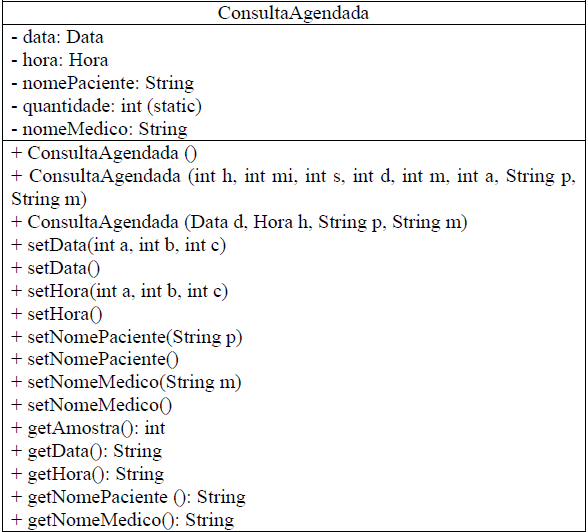

### BEM VINDO👋
 

## Esta é a prova 2 da matéria de LPI13

### Tecnologias que utilizei para a resolução da prova  :

 

 

### Instruções da prova:
 

1) Reescreva as propriedades e métodos da classe Data, deixando-os de acordo com
o padrão UML (Getter e Setter)  
Observações: O valor do prato deve conter duas casas decimais após a virgula;
Lembre-se de descontar a tara do prato no peso da refeição, para assim calcular o
valor corretamente a ser pago.

2) -
  

 
- O construtor ConsultaAgendada deve nos permitir a digitação dos valores de data,
hora, nome do paciente e do médico;  
 Os outros dois construtores devem receber os valores de data, hora, nome do
paciente e do médico sob a forma de parâmetros; 
 Qualquer construtor chamado deve acrescer 1 no atributo quantidade.  
 Os métodos setData(), setHora(), setNomePaciente(), setNomeMedico() devem nos
permitir alterar os valores das respectivas propriedades através da digitação de
novos valores;  
 Os demais métodos “set” devem alterar os valores das propriedades a partir dos
parâmetros recebidos;  
 O método getData() deve nos devolver a data no formato: dd/mm/aa;  
 O método getHora() deve nos devolver a hora no formato: hh:mm:ss  
3) Para testar a classe criada siga os passos abaixo respeitando a ordem em que eles
serão solicitados:  
 Usando a classe ConsultaAgendada instancie o objeto p1 inicializado-o com o
construtor ConsultaAgendada (int h, int mi, int s, int d, int m, int a, String p, String
m);  
 Exiba todas as propriedades de p1;  
 Agora instancie o objeto p2 usando o construtor ConsultaAgendada ();  
 Exiba todas as propriedades de p2;  
 Usando os métodos setData(), setHora(), setNomePaciente(), setNomeMedico altere
as propriedades de p1;  
 Exiba todas as propriedades de p1 novamente.  
 Exiba a quantidade final de consultas. 
 
4) Escreva todo o resultado obtido no exercício 3 em um arquivo texto.  
 

